# Báo cáo Lab Day 1 — Nguyễn Văn Thân — 2A202602859

> Track 4 · Ngày 1 

## 1. Thiết lập

- **Môi trường:** CPU, Python 3.13.13, PyTorch 2.14.0+cpu, numpy 2.5.1, scikit-learn 1.9.1,
  matplotlib 3.11.1, pandas 3.0.3, openpyxl 3.1.5; `torch.get_num_threads() = 6`. 
- **Dữ liệu:** Forest CoverType (581 012 mẫu, 54 đặc trưng, 7 lớp); `train` 464 809 / `eval` 116 203 theo
  `split_metadata.csv`. **Validation** = 20 % của train, phân tầng, seed 42 → **371 847 train /
  92 962 val**. Chuẩn hoá **chỉ 10 cột số** (0..9) bằng mean/std của train, áp nguyên trạng cho val/eval (không rò rỉ).
- **Model:** `M-base` (bắt buộc) `54→256→128→7`, ReLU mỗi lớp ẩn, bias đầy đủ, **47 879 tham số**;
  `M-wide` (161 287) và `M-deep` (55 687) cho thí nghiệm độ rộng/sâu. Không softmax trong model.
- **Baseline (`base-s1`):** CE, SGD+momentum 0,9, lr 0,05, batch 512, 20 epoch, He, fp32, seed 1;
  lr chọn bằng dò trên **val** (`_probe-lr*`).
- **Mốc tham chiếu:** đoán lớp đa số (lớp 1) → accuracy 0,4876, macro-F1 ≈ 0,094.
- **Chủ đề đã thử:** ☑ loss ☑ optimizer ☑ hyper-parameter ☑ dropout ☑ clipping ☑ mixed precision ☑ init.

## 2. Kiểm tra ban đầu và độ nhiễu

| Kiểm tra | Kết quả |
|---|---|
| Số tham số / shape logits | 47 879 (khớp `EXPECTED_PARAMS`) / `(B, 7)` |
| Loss bước 0 (ln 7 = 1,946) | **2,269** (`base-s1`) — giải thích bên dưới |
| Quá khớp 20 mẫu: loss cuối | 1,9668 → **0,000449**; accuracy 20/20 |
| Gradient mọi tham số khác 0 | ☑ hữu hạn, norm > 0 |
| Baseline: số seed / val acc / val macro-F1 | **3** (`base-s1..3`) / **0,8978 ± 0,0024** / **0,8335 ± 0,0095** |

**Ngưỡng nhiễu: 2σ = 0,0191** (val macro-F1); chênh lệch dưới ngưỡng này coi là nhiễu.

**Loss bước 0 = 2,269 > ln 7 = 1,946 không phải lỗi.** Nguyên nhân: `init_weights` áp He cho cả lớp ra,
khiến std logit ≈ 0,6 (lệch khỏi mức ~0 mà phân bố đều 7 lớp cần). Kiểm chứng cơ chế: giữ He cho lớp ẩn,
đặt trọng số lớp ra = 0 → loss bước 0 về đúng 1,946; ×0,1 → 1,958. Đây đúng là triệu chứng
"điểm lớp cuối quá lớn" (bảng chẩn đoán Ch.5); loss vẫn giảm đều nên giữ He (baseline "thuần", không tinh
chỉnh riêng lớp ra). Các init khác cho loss bước 0: normal 1,9460 · zeros 1,9459 · default 1,9830 · xavier 2,0222.

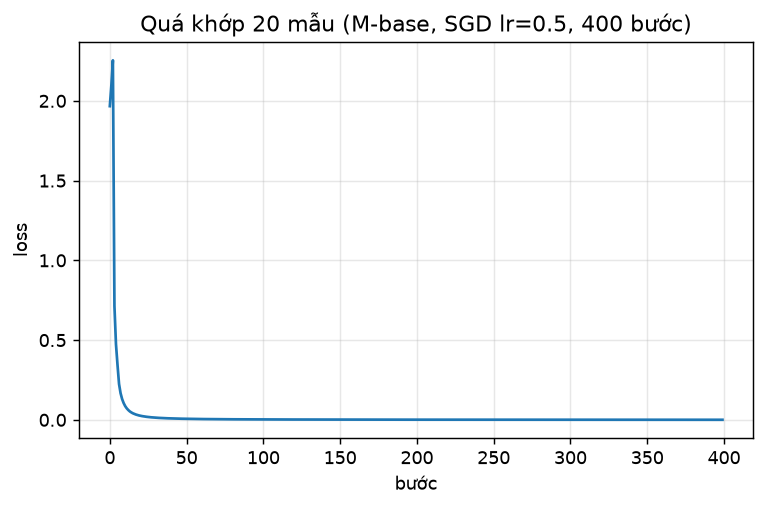
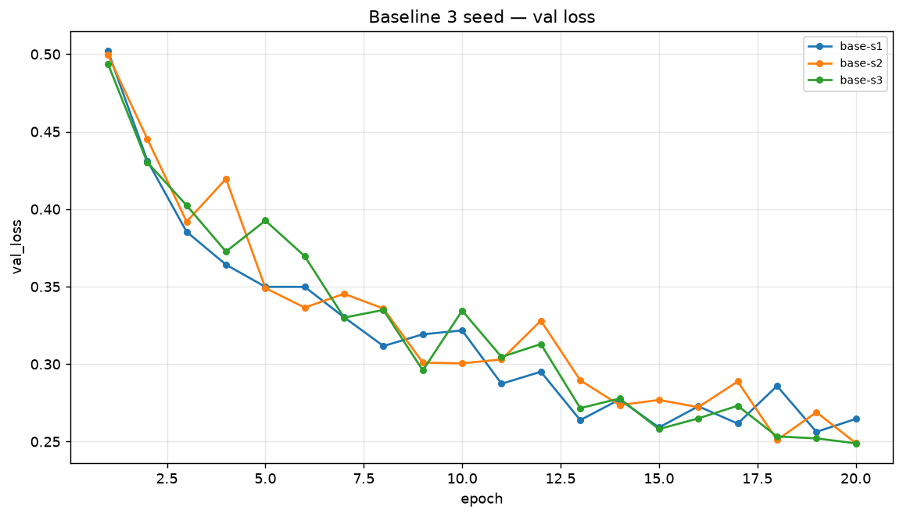

**Nhận xét:** val loss còn giảm tới epoch cuối (best_epoch 19–20/20) → **chưa hội tụ hẳn**; gap train–val loss
nhỏ (+0,0200 ở `base-s1`) → chưa overfit ở 20 epoch; val accuracy ≈ 0,90 ≫ 0,4876.

## 3. Kết quả theo chủ đề

### 3.1 Hàm mất mát — CE vs MSE
- **Dự đoán:** MSE trên one-hot học kém hơn CE ở cùng lr/epoch.
- **Kết quả:** `loss-mse-lr0.05` đạt val macro-F1 **0,6952** (acc 0,8553), thấp hơn baseline trung bình
  **0,138** ≫ 2σ. (Loss bước 0 của MSE = 4,4510 — khác thang đo, không so với ln 7.)
- **Cơ chế:** gradient CE theo logit là `softmax(z) − y`, không bão hoà kể cả khi sai nặng; gradient MSE bị
  nhân bởi `softmax'(z)` nên bão hoà khi xác suất tiến sát 0/1 — mất tín hiệu đúng lúc cần mạnh nhất.
  → CE thắng, đúng dự đoán.

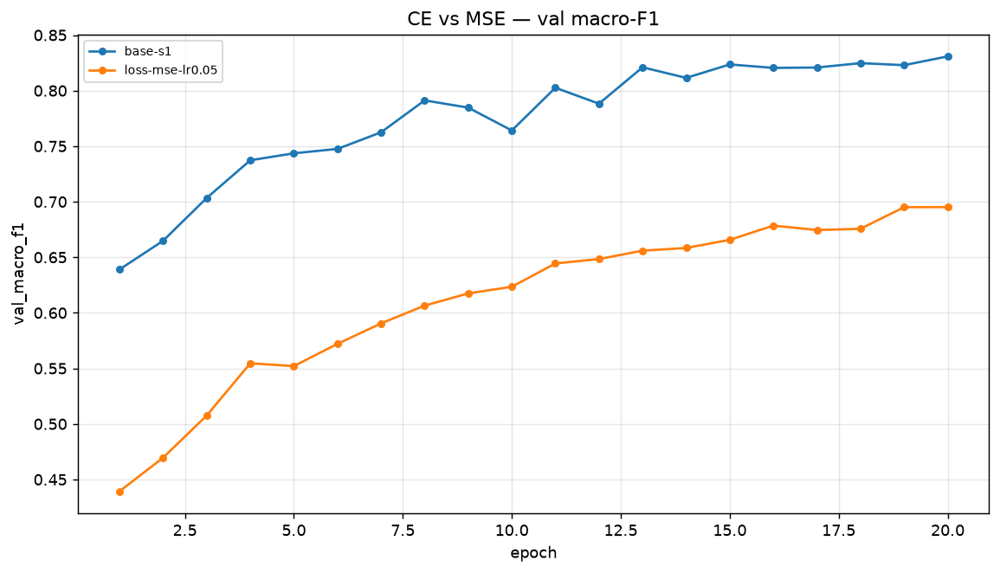

### 3.2 Bộ tối ưu hoá
| Bộ tối ưu | `exp_id` | lr | val macro-F1 | best epoch |
|---|---|---|---|---|
| SGD | `opt-sgd-lr0.2` | 0,2 | 0,7946 | 19 |
| SGD + momentum 0.9 | `opt-sgdm-lr0.2` | 0,2 | 0,8554 | 20 |
| **Adam** | `opt-adam-lr0.003` | 3e-3 | 0,8749 | 19 |
| AdamW (wd 0,01) | `opt-adamw-lr0.003` | 3e-3 | 0,8610 | 20 |

- **Độ nhạy lr:** Adam/AdamW đạt đỉnh trong dải hẹp quanh 3e-3 (1e-2 → 0,8578/0,8495; 1e-3 → 0,8466/0,8434).
  SGD+momentum cải thiện đơn điệu 0,05→0,2 (gợi ý còn tăng); SGD thuần yếu nhất ở mọi lr.
- **Kết luận:** Adam lr=3e-3 thắng khi mỗi bộ được chỉnh lr công bằng, hơn baseline +0,0414 ≈ 4,3σ →
  có ý nghĩa. Kết luận đảo chiều nếu không chỉnh lr: hai dải lr đã dò (SGD 0,05–0,2 vs Adam 1e-3–1e-2)
  không giao nhau, nên so ở cùng một lr chỉ phản ánh lr hợp với bộ nào. Hạn chế: chưa thử Adam ở lr=0,05.

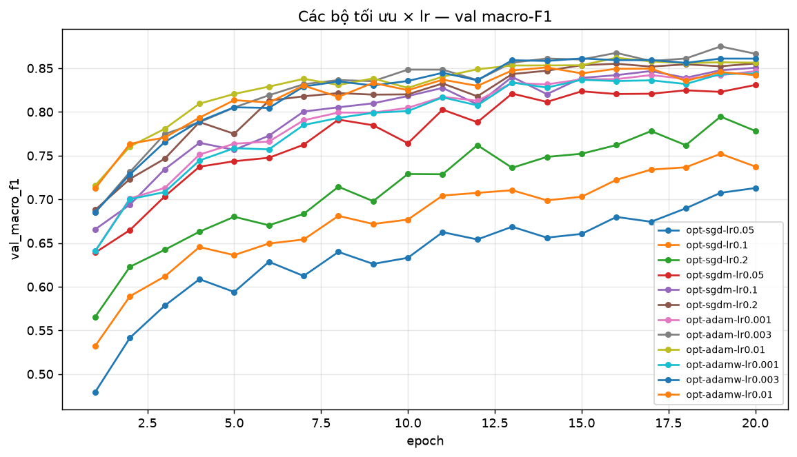

### 3.3 Hyper-parameter
| Yếu tố | `exp_id` | Số bước cập nhật | val macro-F1 | s/epoch |
|---|---|---|---|---|
| baseline | `base-s1` | 14 540 | 0,8229 | 2,18 |
| batch = 128 | `hp-batch128` | 58 120 | 0,8629 | 5,97 |
| batch = 2048 | `hp-batch2048` | 3 640 | 0,7732 | 1,26 |
| `M-wide` | `hp-wide` | 14 540 | 0,8601 | 4,26 |
| `M-deep` | `hp-deep` | 14 540 | 0,8616 | 2,47 |
| weight_decay = 0,01 | `hp-wd1e-2` | 14 540 | 0,3874 | 2,16 |

- **Cơ chế:** batch nhỏ = nhiều bước hơn trong cùng số epoch → batch 128 (+0,029) > baseline > batch 2048
  (−0,060, chỉ 3 640 bước). `M-wide` (+0,027) và `M-deep` (+0,028) vừa vượt 2σ → cải thiện nhẹ nhưng thật.
- `hp-wd1e-2` sụp (0,3874; best_epoch 12 rồi thoái hoá): tương tác wd × lr (wd 0,01 quá mạnh khi
  lr=0,05 với SGD+momentum), không phải "wd vô dụng".

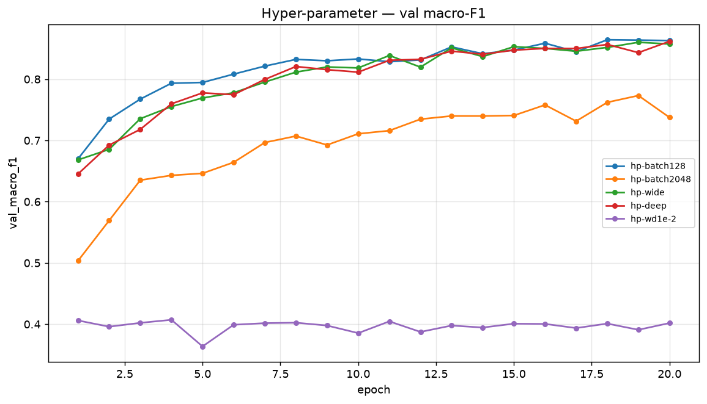

### 3.4 Dropout
| `exp_id` | q | val macro-F1 | train loss | val loss | gap (val−train) |
|---|---|---|---|---|---|
| `base-s1` | 0,0 | 0,8229 | 0,2447 | 0,2646 | +0,0200 |
| `drop-0.1` | 0,1 | 0,8236 | 0,2621 | 0,2727 | +0,0105 |
| `drop-0.3` | 0,3 | 0,7628 | 0,3345 | 0,3389 | +0,0044 |
| `drop-0.5` | 0,5 | 0,6627 | 0,4073 | 0,4099 | +0,0026 |

- **Kết quả:** mô hình **chưa quá khớp** (gap +0,020) nên dropout không giúp: q=0,1 ≈ baseline (trong nhiễu),
  q=0,3/0,5 hại rõ (−0,06 / −0,16) — đúng cơ chế "thuốc cho bệnh không có".
- **Khi nào dùng:** khi gap train–val lớn và val loss quay đầu tăng; ở đây 20 epoch quá ngắn để quá khớp.

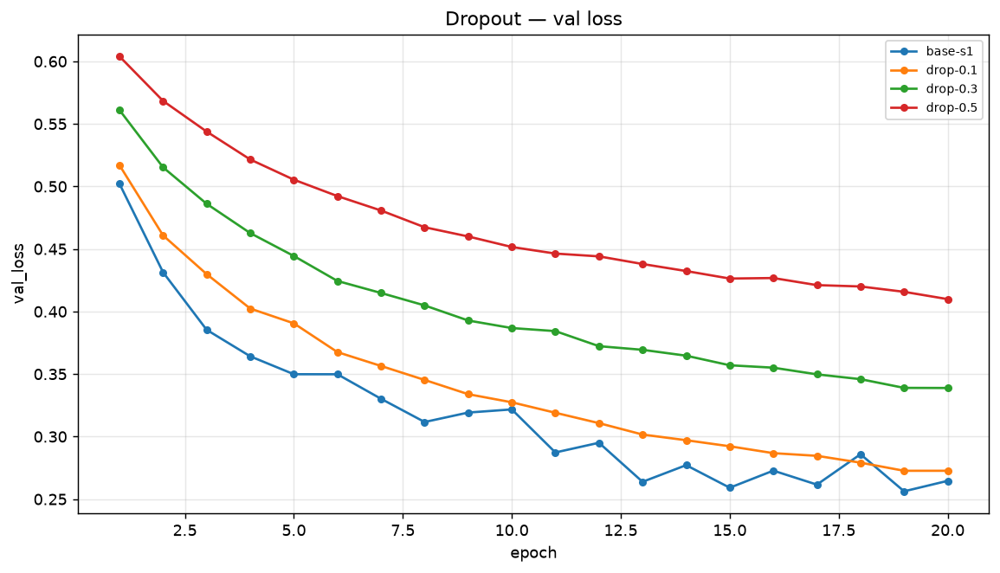

### 3.5 Gradient clipping
`grad_norm` baseline (đo trước clip): trung bình 0,771, lớn nhất 2,908.

| `exp_id` | lr | clip c | val macro-F1 | ‖g‖max | tỉ lệ bước bị clip |
|---|---|---|---|---|---|
| `clip-lr0.05-c1.0` | 0,05 | 1,0 | 0,8272 | 2,91 | 0,193 |
| `clip-lr1.0-noc` | 1,0 | — | 0,7757 | 8,91 | 0 |
| `clip-lr1.0-c1.0` | 1,0 | 1,0 | 0,8193 | 4,27 | 0,010 |
| `clip-lr2.0-noc` | 2,0 | — | 0,0936 (= đoán đa số) | 36,99 | 0 |
| `clip-lr2.0-c1.0` | 2,0 | 1,0 | 0,3425 | 5,28 | 0,017 |
| `clip-lr2.0-c0.5` | 2,0 | 0,5 | 0,4735 | 4,18 | 0,072 |

- **Ở lr thường:** c=1,0 kích hoạt trên 19 % bước nhưng kết quả 0,8272 ≈ baseline → chênh lệch là nhiễu.
- **Ở lr cao:** lr=2,0 không clip sụp về đoán lớp đa số (F1 0,0936, ‖g‖=37); có clip c=0,5 → 0,4735
  (còn học được). Chứng minh vai trò của clip khi lr quá lớn: giới hạn độ lớn bước cập nhật, tránh một bước
  nhảy phá trọng số.

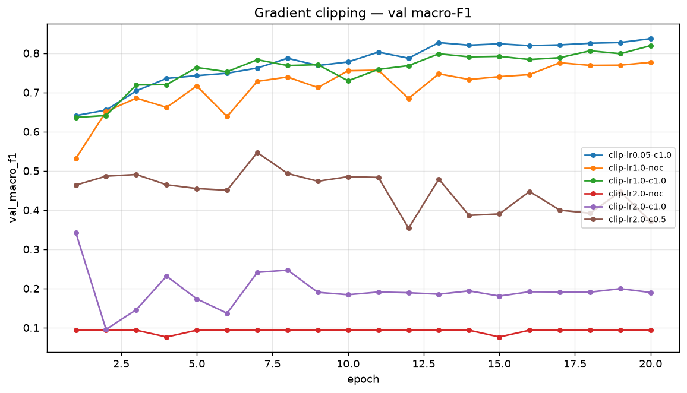

### 3.6 Mixed precision
5 epoch, cùng cấu hình:

| `exp_id` | precision | s/epoch | chậm hơn fp32 | val macro-F1 |
|---|---|---|---|---|
| `amp-fp32` | fp32 | 2,33 | ×1 | 0,7436 |
| `amp-fp16` | fp16 | 90,57 | ×38,9 | 0,7474 |
| `amp-bf16` | bf16 | 64,11 | ×27,5 | 0,7456 |

- **Kết quả:** trên CPU không có tensor core, FP16/BF16 chậm hơn nhiều (chi phí cast/kernel chi phối thay
  vì FLOPs); độ chính xác tương đương fp32 (chênh 0,004 < 2σ). FP16 cần `GradScaler` (dải biểu diễn hẹp);
  BF16 cùng dải mũ với FP32 nên không cần.

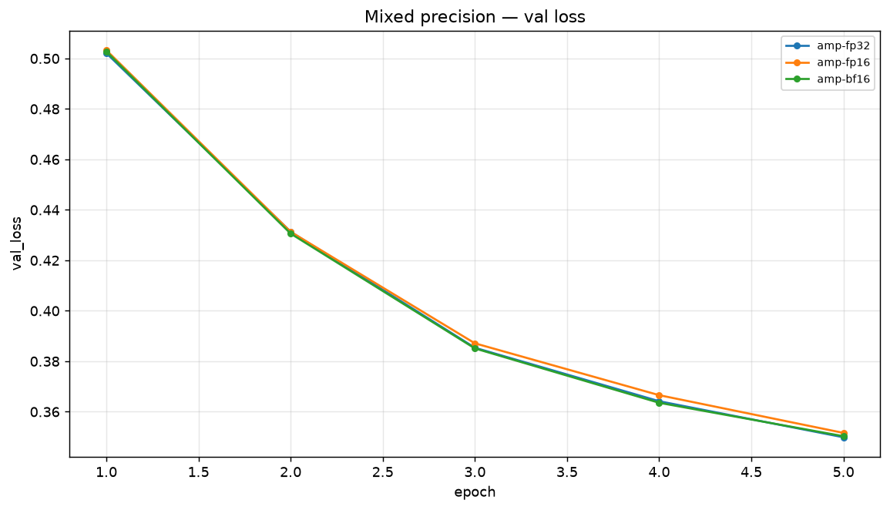

### 3.7 Khởi tạo tham số
| `exp_id` | init | std kích hoạt (lớp ẩn 1, 2) | loss bước 0 | val macro-F1 |
|---|---|---|---|---|
| `init-zeros` | zeros | **[0, 0]** | 1,9459 | **0,0936** |
| `init-normal` | N(0, 0.01²) | [0,0214, 0,0023] | 1,9460 | 0,8194 |
| `init-xavier` | xavier | [0,1665, 0,1371] | 2,0222 | 0,8374 |
| `init-default` | mặc định PyTorch | [0,1649, 0,0666] | 1,9830 | 0,8413 |
| `base-s1` (He) | he | [0,4049, 0,3901] | 2,2691 | 0,8229 |

- **`zeros` hỏng hoàn toàn:** std kích hoạt = 0 mọi lớp → mọi nơ-ron cùng lớp giống nhau → gradient giống
  nhau → đối xứng không bao giờ bị phá; `ReLU(0)=0` khiến lớp ẩn chết; F1 = 0,0936 đúng bằng đoán lớp đa số
  (mạng chỉ học bias lớp ra).
- **He vs Xavier:** He đặt `Var = 2/n_in` bù đúng cho ReLU (triệt ~½ phương sai) → std kích hoạt ổn định
  (~0,40); Xavier `Var = 2/(n_in+n_out)` thiên về tanh nên hơi nhỏ cho ReLU (0,17→0,14). Khác biệt quan trọng
  khi mạng **sâu**; với `M-base` 2 lớp ẩn, các init "tử tế" (he/xavier/default/normal) đều trong khoảng
  0,82–0,84 (chênh ≤ nhiễu), chỉ `zeros` khác biệt về chất.

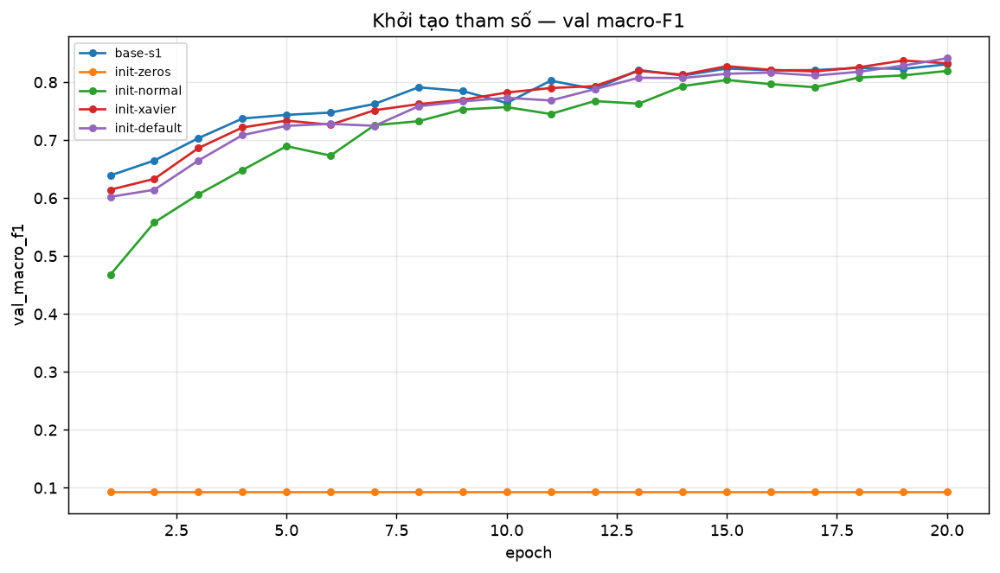

### 3.8 Cấu hình cuối cùng (chọn theo val)
Ghép các yếu tố thắng trên val: Adam lr=3e-3 + `M-wide` + 40 epoch. Bốn ứng viên, chọn theo val, **không nhìn eval**:

| `exp_id` | val macro-F1 |
|---|---|
| `fin-adam3e3` (M-base, 20ep) | 0,8749 |
| `fin-adam3e3-wide` (M-wide, 20ep) | 0,8886 |
| **`fin-adam3e3-wide-40` (M-wide, 40ep)** | **0,9096** ← chọn |
| `fin-adam3e3-deep-40` (M-deep, 40ep) | 0,8989 |

`fin-adam3e3-wide-40` có val macro-F1 cao nhất, hơn baseline **+0,076** ≫ 2σ. `M-deep`-40 kém hơn
`M-wide`-40 dù ít tham số hơn → lợi ích đến từ **số epoch và độ rộng**, không phải độ sâu. best_epoch = 39/40
→ còn đà tăng nhưng dừng để giới hạn thời gian.

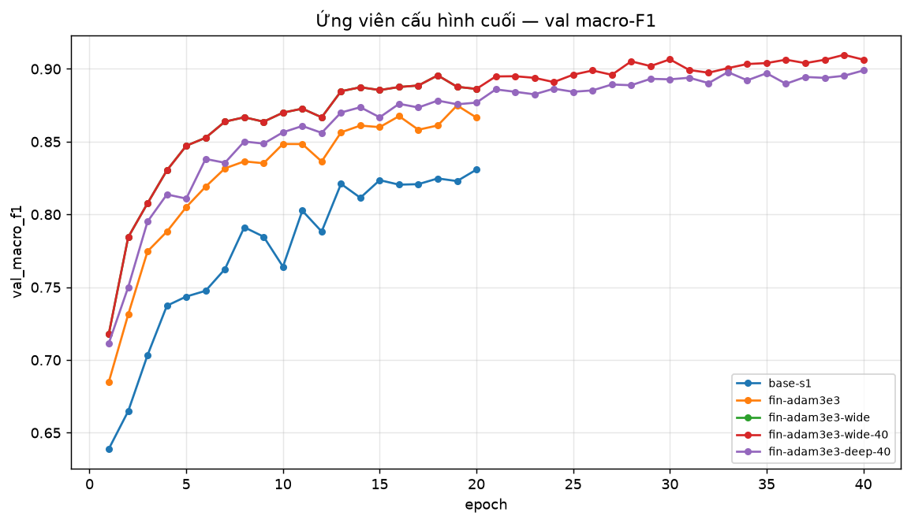

## 4. Đánh giá cuối trên tập eval

Số lấy từ `eval_result.json` / `eval_base.json` do `scripts/evaluate.py` tạo (không tự tính lại).

| Cấu hình | Seed nộp | val macro-F1 | **eval macro-F1** | eval accuracy |
|---|---|---|---|---|
| Baseline (`base-s1`) | 1 | 0,8229 | **0,8254** | 0,8950 |
| Cấu hình cuối (`fin-adam3e3-wide-40`) | 1 | 0,9096 | **0,9057** | 0,9383 |

- **Cấu hình cuối:** `M-wide` (54→512→256→7) + Adam lr=3e-3 + CE + He + batch 512 + 40 epoch, fp32.
- **Cải thiện:** eval macro-F1 **+0,0803** (0,8254→0,9057), accuracy **+0,0433** ≫ 2σ → cải thiện thực sự,
  không phải may mắn seed.
- **Val vs eval:** macro-F1 lệch −0,004; accuracy lệch −0,002 → split val đại diện tốt cho eval, không có dấu
  hiệu chọn quá khớp val.

### 4.1 Phân tích lỗi theo lớp (cấu hình cuối)
| Lớp | Loại rừng | support | precision | recall | F1 |
|---|---|---|---|---|---|
| 0 | Spruce/Fir | 42 368 | 0,9300 | 0,9407 | 0,9353 |
| 1 | Lodgepole Pine | 56 661 | 0,9472 | 0,9465 | 0,9469 |
| 2 | Ponderosa Pine | 7 151 | 0,9420 | 0,9408 | 0,9414 |
| 3 | Cottonwood/Willow | 549 | 0,8052 | 0,8962 | 0,8483 |
| 4 | **Aspen** | 1 899 | 0,8965 | 0,7757 | **0,8317** ← thấp nhất |
| 5 | Douglas-fir | 3 473 | 0,9051 | 0,8871 | 0,8960 |
| 6 | Krummholz | 4 102 | 0,9606 | 0,9213 | 0,9405 |

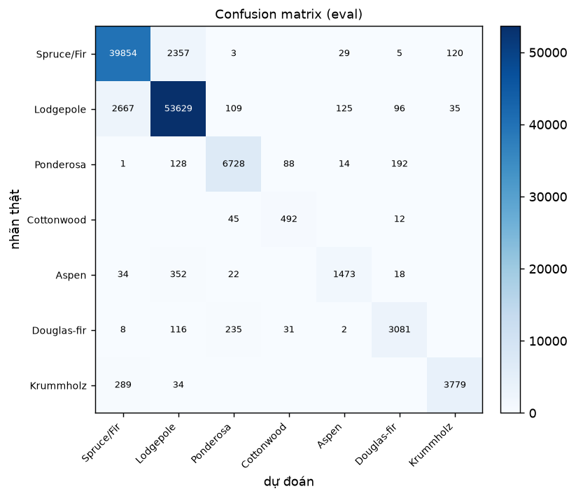

- **Lớp khó nhất: lớp 4 (Aspen), F1 = 0,8317**, recall thấp (0,776); chủ yếu nhầm sang **lớp 1 (Lodgepole)**:
  352/1 899 mẫu. Lớp 3 (Cottonwood) precision thấp (0,805) dù chỉ 549 mẫu.
- **Lý giải:** Aspen và Lodgepole cùng phân bố ở sườn núi độ cao trung bình, các biến địa hình (Elevation,
  Hillshade, Distance_To_Hydrology) chồng lấn; Aspen chỉ 1,6 % số mẫu nên mô hình ưu tiên lớp đa số. So với
  baseline, cấu hình cuối cải thiện **mọi** lớp, mạnh nhất ở lớp hiếm: lớp 4 0,7233→0,8317 (+0,108),
  lớp 5 0,7119→0,8960 (+0,184), lớp 3 0,7591→0,8483 (+0,089).
- **Hướng cải thiện:** (1) class-weighted CE / focal loss cho lớp 3/4/5; (2) oversample lớp hiếm;
  (3) ngưỡng quyết định riêng theo lớp; (4) thêm đặc trưng tương tác (Elevation × Hillshade).

## 5. Trả lời câu hỏi dẫn dắt

1. **Bộ tối ưu thắng khi chỉnh lr công bằng?** Adam lr=3e-3 (val 0,8749), hơn baseline **+0,0414 ≈ 4,3σ**.
   Kết luận **phụ thuộc việc chỉnh lr**: hai dải lr đã dò không giao nhau, nên so ở cùng một lr chỉ phản ánh
   lr hợp với bộ nào. Hạn chế: chưa thử Adam lr<1e-3 hay SGD lr>0,2.
2. **Dropout khi chưa quá khớp?** Không giúp — gap chỉ +0,020; q=0,1 ≈ baseline, q=0,3/0,5 hại. Chỉ dùng
   khi gap train–val lớn và val loss quay đầu tăng, với q nhỏ (0,1–0,3).
3. **Clipping giải quyết gì?** Giới hạn độ lớn bước khi gradient đột biến. Bằng chứng: lr=2,0 không clip →
   sụp (F1 0,0936, ‖g‖=37); có clip c=0,5 → 0,4735. Ở lr thường ‖g‖≈0,8–2,9 nên c=1,0 hầu như không đổi kết quả.
4. **Mixed precision có nhanh hơn không?** Trên CPU không — fp16 ×38,9, bf16 ×27,5 so với fp32, do không có
   tensor core; độ chính xác tương đương fp32.
5. **Vì sao zeros hỏng? He khác Xavier?** `zeros`: mọi nơ-ron cùng lớp giống nhau → gradient giống nhau →
   đối xứng không bị phá; `ReLU(0)=0` khiến lớp ẩn chết (F1 = đoán đa số). He dùng `Var = 2/n_in` bù ReLU,
   giữ std kích hoạt ổn định; Xavier `Var = 2/(n_in+n_out)` thiên tanh nên hơi nhỏ cho ReLU — khác biệt quan
   trọng khi mạng sâu.
6. **Loss không giảm sau 2 000 bước — 3 phép kiểm tra đầu tiên:** (a) **dữ liệu/nhãn & pipeline** — quá khớp
   20 mẫu (loss về 0,0004, acc 100 %); nếu không về 0 → lỗi nhãn/shape/`zero_grad`/optimizer. (b) **loss bước
   0 & độ lớn logit** — so với ln 7 để phát hiện đầu ra quá lớn/nhỏ hoặc softmax hai lần. (c) **gradient** —
   mọi tham số có grad hữu hạn khác 0, và `grad_norm` theo bước — phân biệt "gradient biến mất" với "lr sai".
   Cả ba đều rẻ và cô lập được lỗi **dữ liệu / kiến trúc / vòng lặp**.

## 6. Hạn chế và điều bất ngờ

- **Khác dự đoán:** (i) Adam hơn baseline rõ (+0,0414) nhưng phần lớn lợi ích đến từ **chỉnh lr** — đổi bộ
  tối ưu mà giữ lr sẽ không giúp; (ii) `hp-wd1e-2` sụp (0,3874) — tương tác mạnh wd × lr; (iii) mixed
  precision trên CPU chậm tới ×39.
- **Thiết kế có thể làm kết luận sai:** chỉ **3 seed** đo nhiễu (σ còn thô); thí nghiệm cùng số epoch nhưng
  **khác số bước** (batch 128 vs 2048); lr mỗi bộ mới thử 3 giá trị (SGD+momentum còn tăng theo lr);
  cấu hình cuối dựa trên **1 seed**.
- **Nếu có thêm thời gian:** chạy cấu hình cuối với **≥3 seed** (báo cáo eval macro-F1 dạng TB ± σ);
  class-weighted CE / focal loss cho lớp hiếm; cosine scheduler + 60–80 epoch (best_epoch 39/40);
  batch 128 kết hợp Adam 3e-3.

## 7. Phụ lục

- **File đã nộp:** `REPORT.md`, `experiments.xlsx` (41 dòng), `predictions_eval.csv` (116 203 dòng),
  `eval_result.json`, `figures/` (41 ảnh `<exp_id>.png` + 11 ảnh `compare_*.png` + `eval_confusion.png`
  + `eval_per_class_f1.png` + `part1_overfit20.png`), `results/` (41 JSON), `code/` (`lab.ipynb`, `data.py`,
  `model.py`, `optimizer.py`, `train.py`, `plots.py`, `results_table.py`, `experiments.py`, `requirements.txt`).
- **Thời gian chạy:** 41 lần huấn luyện chính ≈ **52 phút** (CPU, tổng `epoch_time_s`); cộng 2 lần huấn luyện
  lại lấy `best_state` cho eval ≈ 4 phút; tổng ≈ **1 giờ** (chưa kể `amp-fp16`/`amp-bf16` ~65–91 s/epoch).
